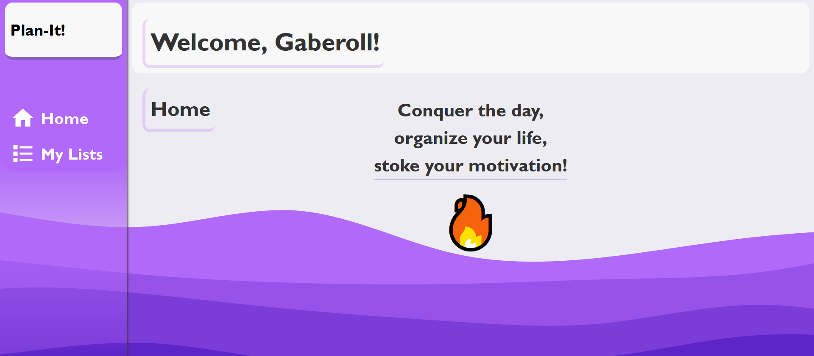
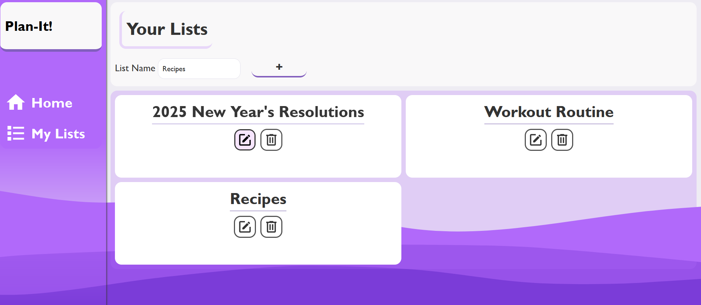

# :notebook_with_decorative_cover: Plan-It! :milky_way:

    

## Table of Contents

- [About](#about)
- [Installation / Website Demo](#installation--website-demo)
- [Features](#features)
- [Tech Stack](#tech-stack)

## About

Plan-It! is a web-based activity logger created using HTML5/CSS3/JavaScript (ES6+), and refactored into SASS/SCSS & TypeScript, and modularized to better exhibit industry practices. This is a Webpack project that offers a convenient user experience, allowing users to organize daily tasks and responsibilities with ease.The user can make different lists that store their own set of tasks, each with ample CRUD functionality and persistent data management using localStorage API.

## Installation / Website Demo

The website is hosted on GitHub Pages, and can be accessed below:

[Plan-It!](https://gaberashko.github.io/plan-it/#home)

Otherwise, the project's functionality can be tested through the following steps:

1. Download the repository.
2. Extract the repository.
3. Open the folder in VSCode, and run `npm install`.
4. Then, run `npx webpack serve`.
5. Locate the `http://localhost:8080/` output in the terminal.
6. Hold <kbd>Ctrl</kbd> and click on `http://localhost:8080/`, and the hosted deployment version will open.

## Features

✅ Create, delete, and edit tasks
🔄 Mark tasks as completed or incomplete
💾 Data is automatically saved using localStorage
♻️ Fully modular codebase with TypeScript and SCSS
🎯 Responsive layout for mobile and desktop

## Tech Stack

- 🛠️ **HTML5 / CSS3 / JavaScript (ES6+)** - Languages used for initial website architecture.
- ⚙️ **TypeScript** - Refactored JavaScript to adhere to industry-standard code quality via static typing.
- 🎨 **SCSS** - Refactored CSS with greater emphasis on modularity.
- 🧱 **Webpack** - For module bundling and asset management.
- 💾 **localStorage API** - Used to handle persistent client-side data.
- ✨ **GSAP** - Background animation with MorphSVG.
- 🚩 **Jest** - Unit testing of modular components.

### Enjoy! :white_check_mark:

[Back to Top](#plan-it)
